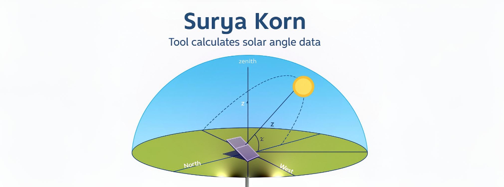
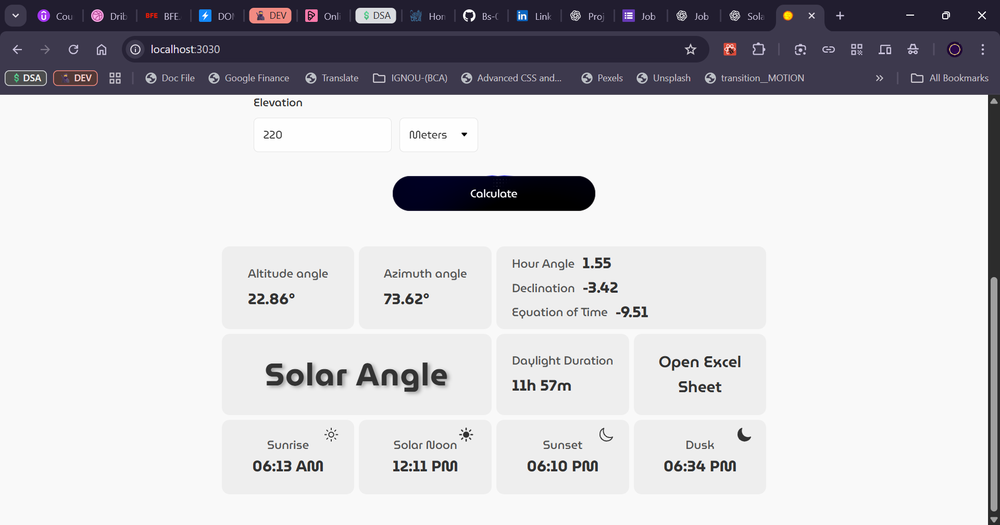
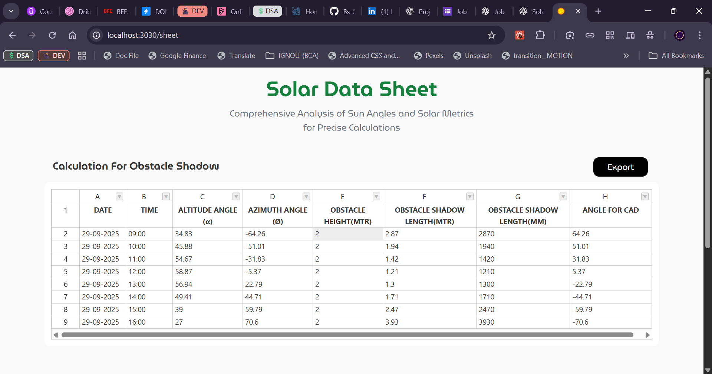
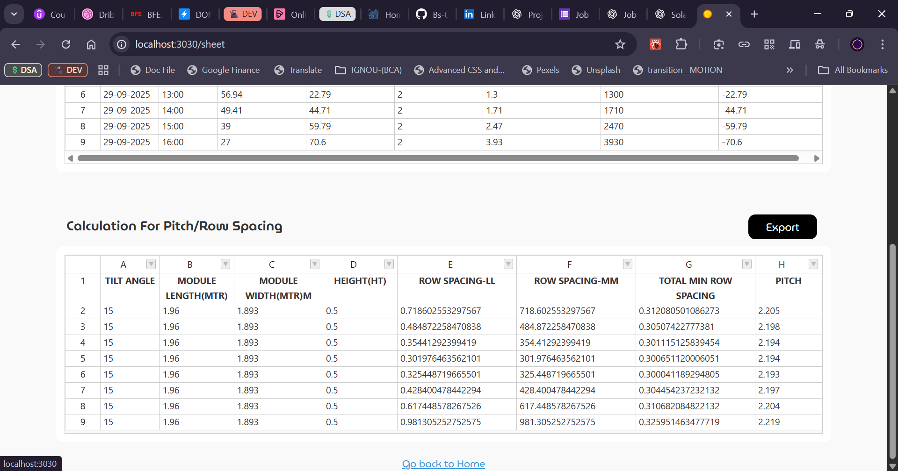

<p align="center">
  
</p>

# Solar Angle Calculator

**A computational tool for solar geometry analysis — precision solar geometry for PV planning, architectural design, and research.**

---

## 🔬 Abstract

The **Solar Angle Calculator** is an interactive application that computes high-precision solar positional parameters required for photovoltaic system design, shading studies, and solar resource assessment. The tool implements established astronomical algorithms to compute solar declination, equation of time (EoT), true solar time, hour angle, solar altitude, and azimuth. It supports adjustable azimuth reference frames (North/East/South/West), batch temporal analysis, and export-ready tabular outputs suitable for integration with spreadsheet software and simulation workflows.

The interface balances research-grade computational fidelity with a modern, responsive UI to facilitate practical use by engineers, researchers, and students.

---

## 📸 Project Screenshots

### Application — Input Form


### Results — Calculated Angles & Summary



### Solar Data Sheet — Obstacle Shadow (batch)



### Solar Data Sheet — Pitch / Row Spacing



---

## 🧭 Key Capabilities

- **Instantaneous solar geometry:** altitude, azimuth, declination, hour angle
- **Time corrections:** equation of time and true solar time adjustments
- **Sunrise / solar noon / sunset / dusk** calculations
- **Zero-azimuth reference:** configurable (North / East / South / West)
- **Batch computations:** generate time series (e.g., every 15 minutes) for a day or date range
- **Exportable tabular output:** CSV / spreadsheet–ready tables for shading and PV layout analysis
- **Derived metrics:** obstacle shadow length, row/pitch spacing calculations for PV arrays
- **Modern UI:** responsive layout with animations and charts for data visualization

---

## ⚙️ Methods (short)

The implementation follows standard solar geometry steps:

1. Convert local date/time → UTC → fractional day.
2. Compute **solar declination** (δ) using day-of-year formulas.
3. Compute **equation of time** (EoT) to correct mean solar time → true solar time.
4. Compute **hour angle** (H) from true solar time.
5. Compute **altitude** (α) and **azimuth** (Ø) from latitude (φ), declination (δ), and hour angle (H).
6. Apply **zero-azimuth offset** (North=0°, East=+90°, South=+180°, West=+270°) and normalize to [0,360).
7. Derive sunrise/sunset from when altitude crosses zero and compute daylight duration.

---

## ▶️ Installation (development)

```bash
git clone https://github.com/Bs-07/Solar_angle.git
cd Solar_angle
npm install
npm run dev
```

## 📜 How to Cite

If you use this tool in academic work, research papers, or technical reports, please cite the repository as:

```
Surya Korn — Solar Angle Calculator. GitHub repository.
Bhoopendra Singh. https://github.com/Bs-07/Solar_angle
```

## 🤝 Contributing

Contributions are warmly welcomed!

You can help improve:

- 🔧 Formula accuracy and scientific validation

- 🎨 UI/UX and data visualization

- 🧮 Batch processing and Excel/CSV export features
- 🌍 Localization and timezone handling

- 🧱 Code structure, optimization, or documentation

### To contribute:

- Fork the repository
- Create a new branch
- Commit your improvements
- Open a Pull Request
- Or simply open an Issue for discussion
